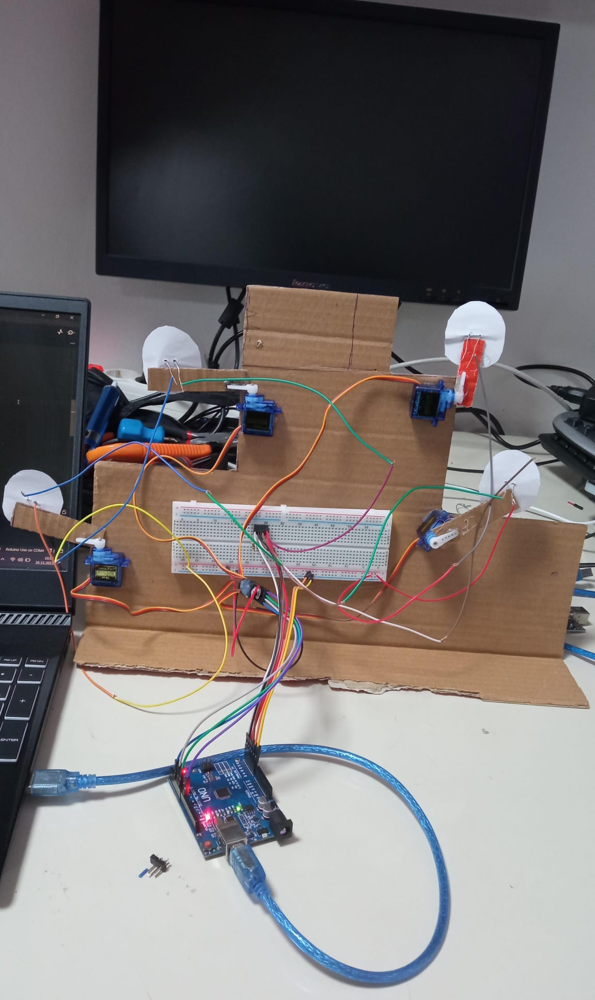
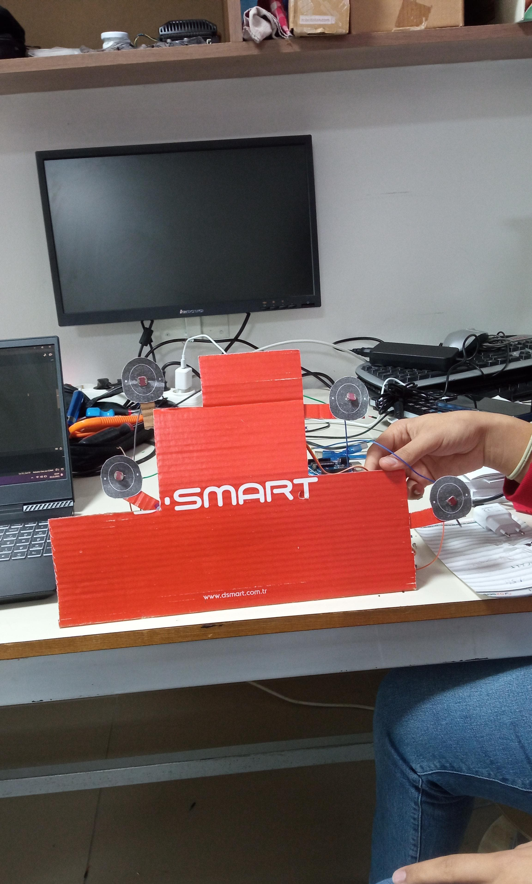
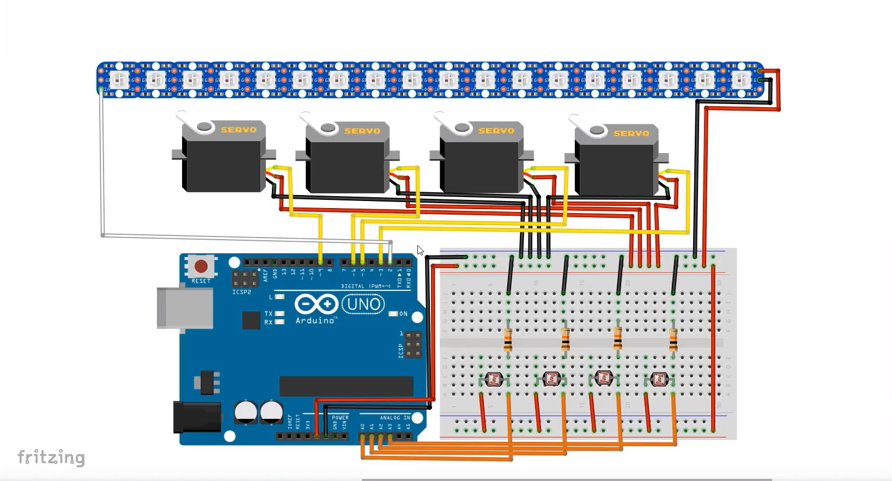

# Arduino Target Shooting Game
This project includes a target shooting game running on the Arduino platform. The game is implemented using four servo motors and a NeoPixel strip. Players earn points by aiming at targets that appear within a certain period of time.

## Preview

## Use
1. Connect your Arduino board to your computer.
2. Open the Arduino IDE or another compatible development environment.
3. Load the project into code and upload it to your Arduino board.
4. Assemble your circuit and start the game.

## Hardware Requirements
- Arduino Board
- Four Servo Motors
- Adafruit NeoPixel Strip
- Four Ldrs
-Breadboard
-Goals
-Silicone Gun
-Soldering Machine
- Male Headers
-Male to Male Cables
-Male Female Cables
-Battery
-Laser
-Battery bed

## Dependencies
- Servo library
- Adafruit NeoPixel library
- ## Report a Problem

Found a problem with our project? Please let me know! [Report issues here](https://github.com/abdullah-tanriverdi/ShootingRangeArduino/issues).

